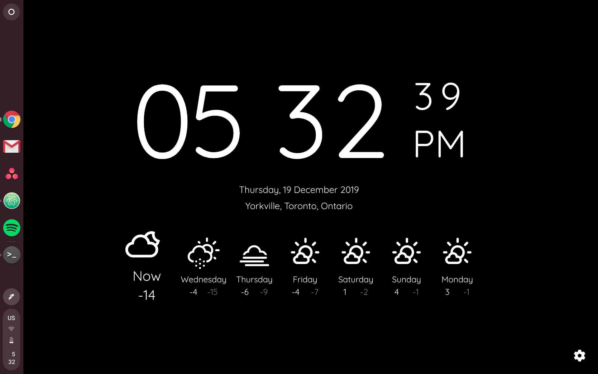

# Chrome Extension: New Page + Time + Weather + TTC updates
A small personal project to create a Google Chrome extension for a new tab page with time/date, weather powered by Dark Sky, and TTC (Toronto Transit) alerts

[](https://forthebadge.com) [](https://forthebadge.com) [](https://forthebadge.com)
---
### Powered by:
Weather: [Open Weather Map](https://openweathermap.org)  
Geocoding: [OpenStreetMap](https://openstreetmap.org/)  
Time: [Moment JS](https://momentjs.com/)  
React: [React JS](https://reactjs.org/)  
Icons: [Open Weather Map](https://openweathermap.org/weather-conditions) & [Font Awesome](https://fontawesome.com/)  

---
### Application Views:


---
### Functionality:
Originally inspired by [Currently Chrome Extension](https://chrome.google.com/webstore/detail/currently/ojhmphdkpgbibohbnpbfiefkgieacjmh?hl=en)

Added features:
- More detailed weather information (click on the forecast for `Now` or each day)
  - Weather alerts (if present)
  - Summary
  - Feels like temperature (on `Now` only)
  - Precipitation probability
  - Wind data
  - Humidity
- Set location (click on location to change)
- More detailed weather icon usage (icons change depending on current time and/or precipitation time)
- Fullscreen clock mode
- Shows link to alert if TTC subways or streetcars have service alerts
- Convert between imperial and metric units

---
### Installation Instructions:

Note: The original purpose of this project was to customize a home screen - not for large scale deployment/distribution. Please use the various APIs according to policies specified by Open Weather Map. The purpose of this document is to simply relay how to deploy this extension on a personal platform.

Needed (API keys):
- [Open Weather Map](https://openweathermap.org)

Instructions:

1. `git clone https://github.com/aalu1418/chromeExtension-newTab`
1. Navigate to the `chromeExtension-newTab` folder and run `yarn`
1. Create a `.env` file in the same folder as the `package.json` file. It should include:
  ```
  REACT_APP_WEATHER_KEY= <your-weather-key-here>
  ```
1. Run `yarn build`
1. In Google Chrome, go to `chrome://extensions` and enable `Developer mode`
1. Select `Pack extension` and in the `Extension root directory` browse to the `build` folder
1. Select `Pack extension` and two files will be generated `build.crx` and `build.pem`
1. From your file browser, click and drag `build.crx` onto the `chrome://extensions` page and install the extension

---
### Resources:
[Storing api keys](https://medium.com/better-programming/using-environment-variables-in-reactjs-9ad9c5322408)  
[CORS proxies](https://nordicapis.com/10-free-to-use-cors-proxies/)  
[Simple Chrome Extension](https://medium.com/javascript-in-plain-english/https-medium-com-javascript-in-plain-english-how-to-build-a-simple-chrome-extension-in-vanilla-javascript-e52b2994aeeb)  
[React + Chrome Extension](https://medium.com/@gilfink/building-a-chrome-extension-using-react-c5bfe45aaf36)  
[React + Zeit](https://zeit.co/guides/deploying-react-with-now-cra/)
